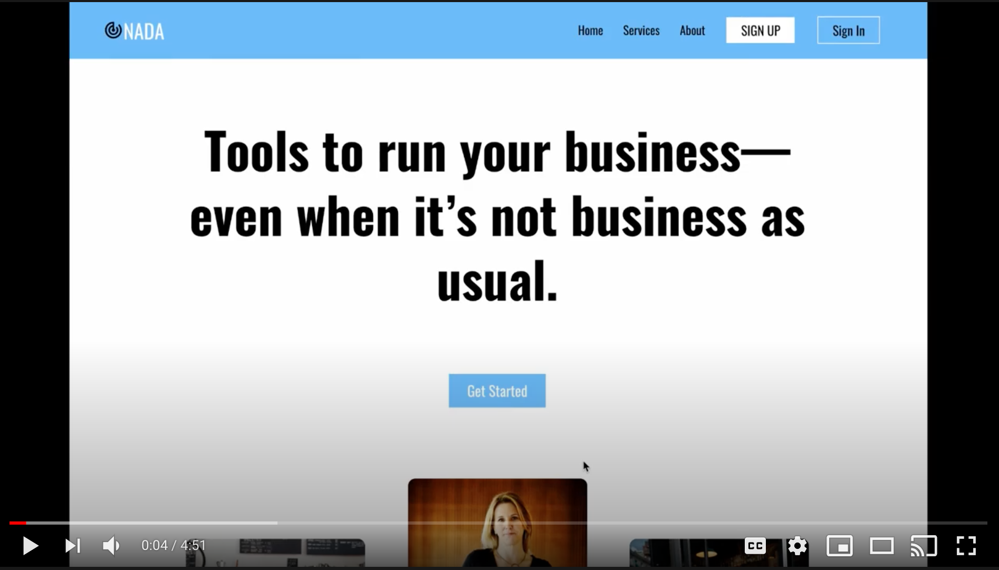
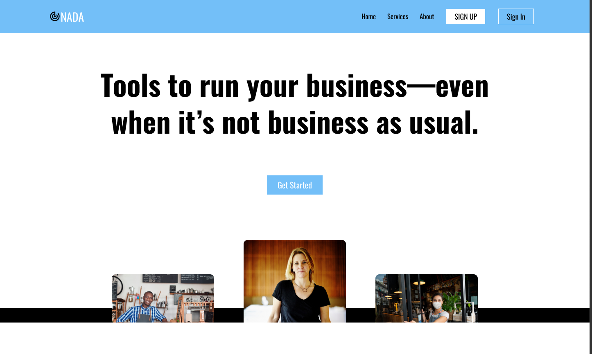
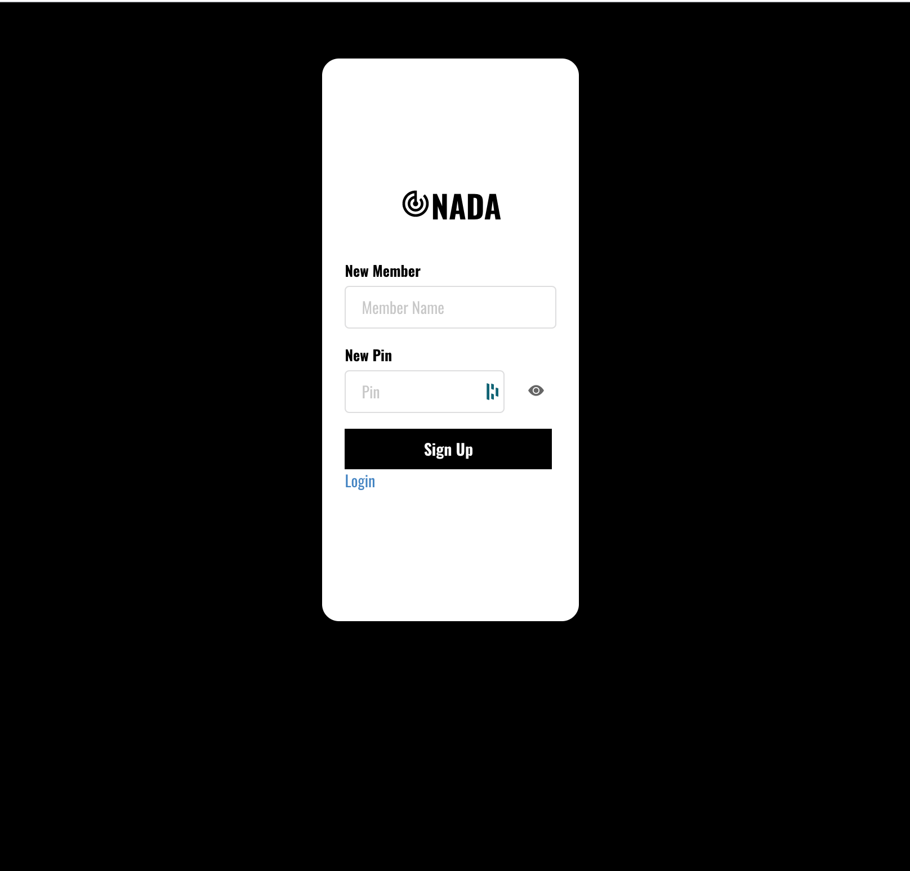
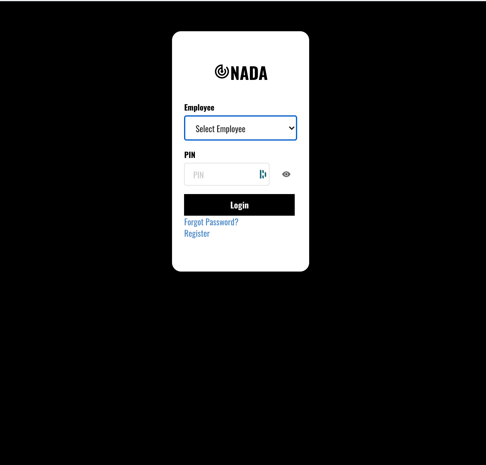
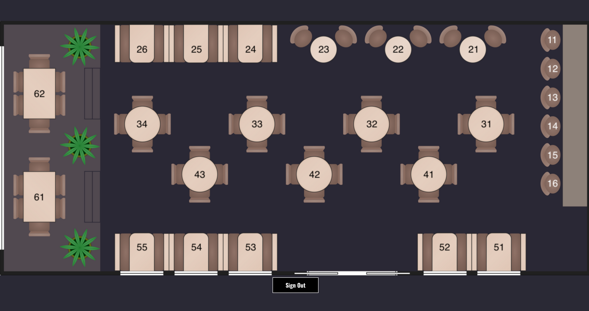
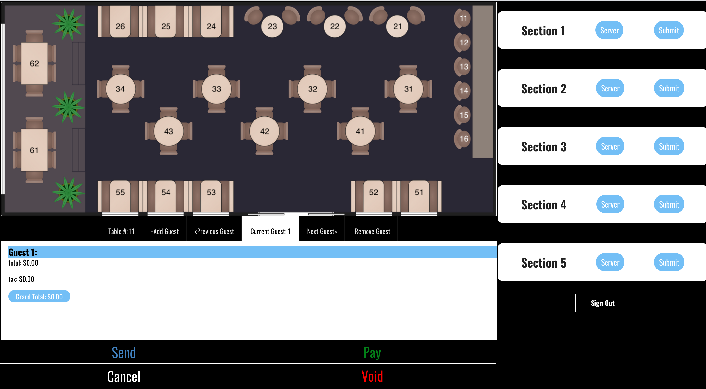
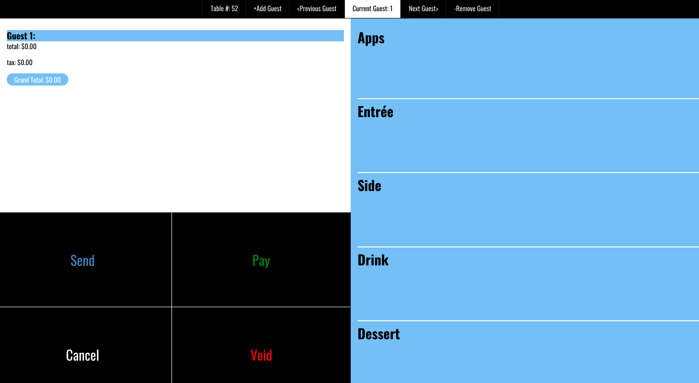
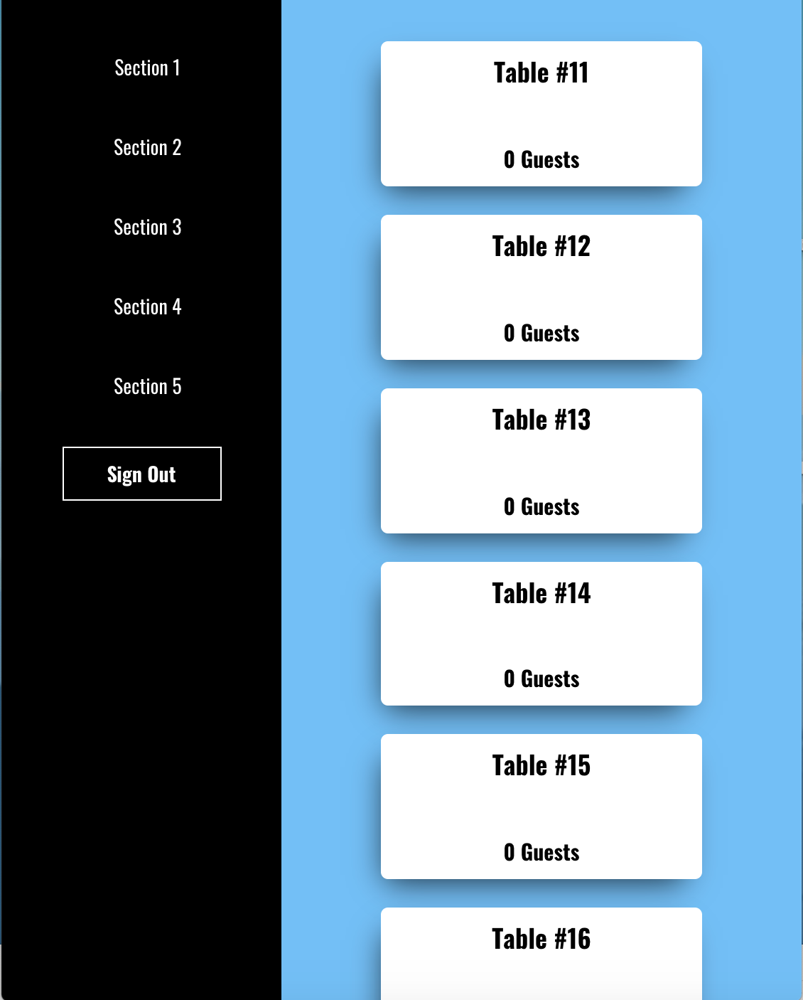

# NADA P.O.S.

<a href="https://nada-pos.herokuapp.com/">NADA P.O.S. (live site link)</a>
For testing go to Sign In link and then login as "`Manager`" with PIN: "`1234`" 
(Please be aware that the site is hosted on Heroku and may take 20-30 seconds to load initially) 

##### In the words of `Wolfgang Puck` :
 *"A lot of restaurants serve good food, but they don't have very good service"*

> 
 
NADA P.O.S. was created for restaurants to allow their waiters remote access to the restaurant's Point-of-Sale system. This allows the waiters to go directly to the tables in their assigned section to take food and drink orders, and then send them directly to the kitchen from their own personal tablets and cellphones.

## **Available Scripts**
In the project directory, you can run:
### `npm run dev`
Runs the app in the development mode. 
The page will reload if you make edits. 
You will also see any lint errors in the console.

In the client directory, you can run:
### `npm run start`
Runs the app in the development mode. 
Open [http://localhost:3001](http://localhost:3001) to view it in the browser.
The page will reload if you make edits. 
You will also see any lint errors in the console.

## **Languages and Technologies used:**
* <a href="https://reactjs.org/">React</a>
    * [Semantic UI React](https://react.semantic-ui.com/) || [React Image Mapper](https://www.npmjs.com/package/react-image-mapper)
* <a href="https://redux.js.org/">Redux</a>
    * <a href="https://www.npmjs.com/package/redux-thunk">Redux Thunk</a>
* <a href="https://developer.mozilla.org/en-US/docs/Web/JavaScript">JavaScript</a>
* <a href="https://www.postgresql.org/">PostgreSQL</a>
* <a href="https://nodejs.org/en/">Node.js</a>
  * [Express](https://expressjs.com/) || [Sequelize](https://sequelize.org/) || [Axios](https://www.npmjs.com/package/axios) || [Passport](http://www.passportjs.org/) || [bcrypt](https://www.npmjs.com/package/bcrypt)
* <a href="https://developer.mozilla.org/en-US/docs/Web/CSS">CSS</a>
* <a href="https://developer.mozilla.org/en-US/docs/Web/HTML">HTML</a>

## **Creators**

<table>
  <tr>
 <td 

Thor Hlavaty  
[ LinkedIn](https://www.linkedin.com/in/thor-hlavaty-7589431b5/)
&nbsp;
[ GitHub](https://github.com/ThorHlavaty)</td>

 <td 

Andrew Pham  
[ LinkedIn](https://www.linkedin.com/in/andrew-pham-phamand2/)
&nbsp;
[ GitHub](https://github.com/phamand2)</td>

 <td 

Vincent Robinson  
[ LinkedIn](https://www.linkedin.com/in/vincentarobinson/)
&nbsp;
[ GitHub](https://github.com/Varobinson)</td>

<td 

Jackson Godwin  
[ LinkedIn](https://www.linkedin.com/in/jackson-godwin/)
&nbsp;
[ GitHub](https://github.com/JaxAttaxx)</td>

  </tr>
</table>

## **Site Walkthrough**

### **Arrival**

As a user arrives they are greeted with a Homepage with general information about the service and has links to a Sign Up page if they are first time users, and a Login page if they are a returning user.
 
 

### **Register Page**

Here on the Register page a new user will create an account using Name, and a PIN. 
 
 

### **Login Page**

A user with an existing account will enter their login credentials to then gain access the Dashboard page.
 
 

### **Server Dashboard**

The server dashboard (on larger screens) allows registered servers to be able to click directly on the tables in their section to then go to the order page for that table.
 
 

### **Manager Dashboard**

The manager dashboard (on larger screens) allows management to have access to all of the tables and their orders, as well as control which servers are assigned to each section of tables.
 
 

### **Order Page**

This page is where managers and servers will enter the food and drink orders for each table that can also be broken down to each individual at the table.
 
 

### **Mobile Layout**

This is the layout that is visible on smaller sized screens so that servers can take orders directly at the tables using tablets or even on their own personal cellphones!
 
 
 

# *Thank you!*